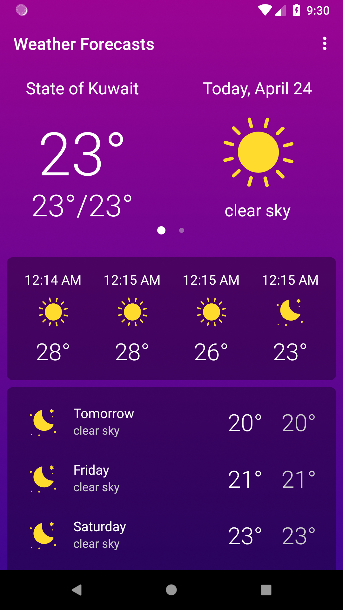
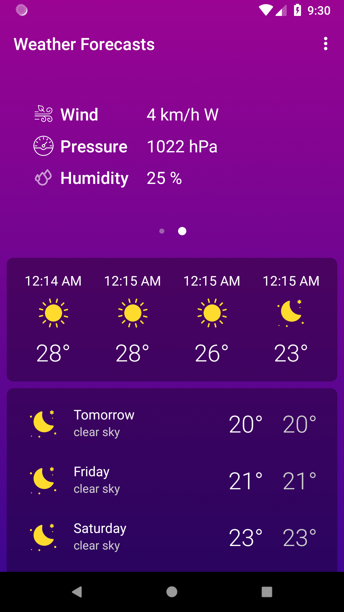
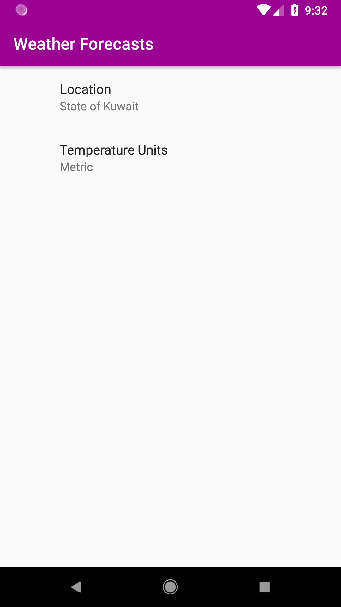
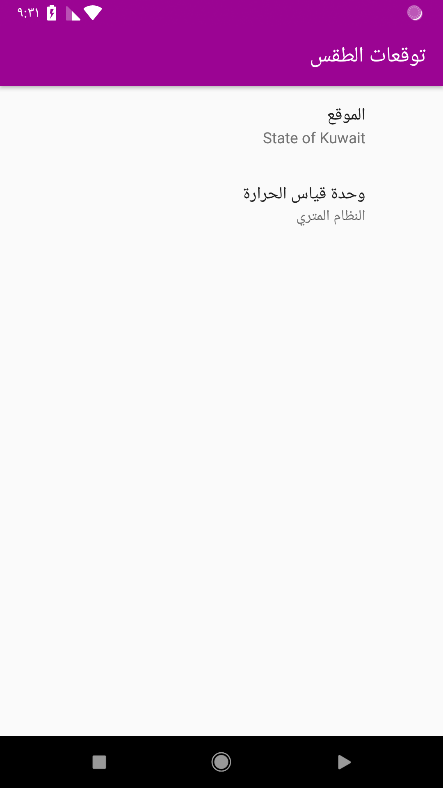
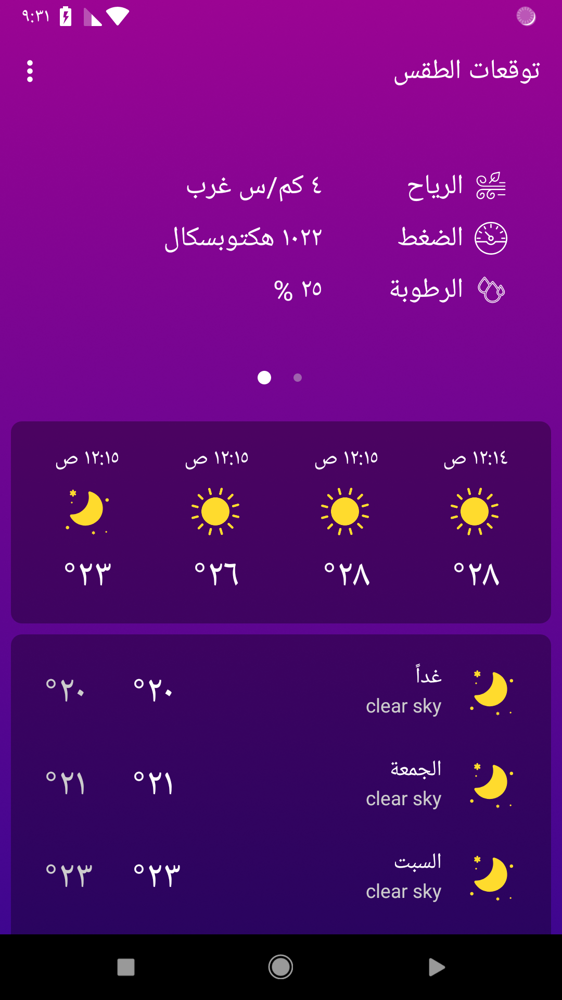
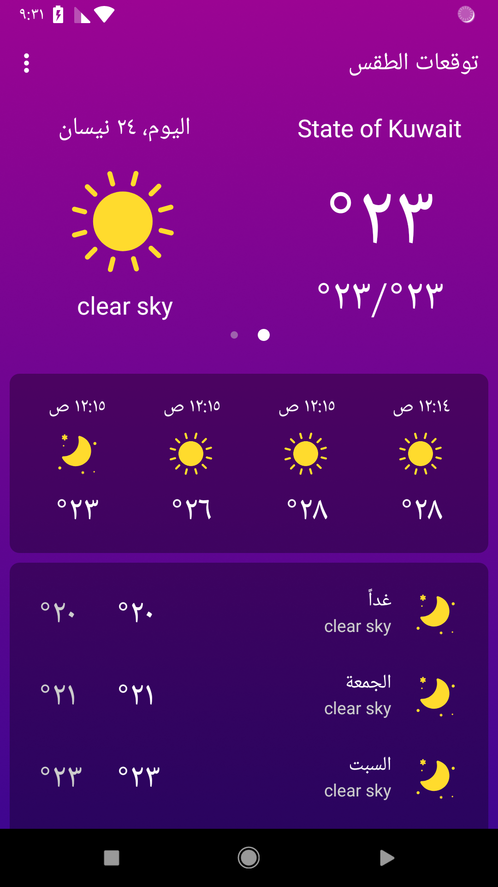

# Weather Forecasts Android App (Phase 1)

This is the repository for the weather app that students build during [the Android Degree at Barmej.com](https://www.barmej.com/degree/android)

This app is a simple Android app that show current weather info and the upcoming weather forecasts. This app use free [OpenWeatherMap](https://openweathermap.org/api) APIs to get the weather information.

To use this repository, fork/clone it, or download a zip using the green "Clone or download" button at the top of the file list. Each branch correspond a video lesson in the course.
After you clone the app you need to replace the api key in the strings with you own api key which you can get from OpenWeatherMap after creating your own free account.
```xml
<string name="api_key" translatable="false">YOUR API KEY HERE</string>
```


# Screenshots
  

  


# Contributing
All contributions are welcome and gratefully accepted.

# License
[](https://opensource.org/licenses/MPL-2.0)

A copy of the license is also available in the [license file](LICENSE).

# Demo
<a href='https://play.google.com/store/apps/details?id=com.barmej.weatherforecasts&utm_source=github&pcampaignid=MKT-Other-global-all-co-prtnr-py-PartBadge-Mar2515-1'></a>

